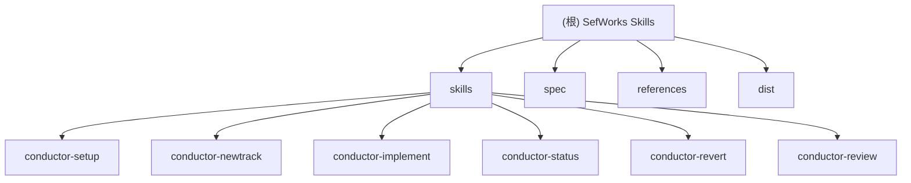

# SefWorks Skills - AI Agent Skills 库

> AI Agent Skills 项目上下文文档 - Conductor 框架技能库

## 项目愿景

SefWorks Skills 是一个 AI Agent Skills 库，基于 **Conductor 框架** 实现上下文驱动开发（Context-Driven Development）。该项目提供一套完整的技能模块，用于管理 AI 辅助软件开发的完整生命周期，从项目初始化、任务规划、实施执行到代码审查和回滚操作。

核心目标：
- **Plan before you build** - 确保每项任务都有清晰的规格说明和可执行的实施计划
- **Test-Driven Development** - 遵循 Red/Green/Refactor 的 TDD 流程
- **Documentation as Source of Truth** - 维护项目产品定义、技术栈和工作流的结构化文档

---

## 架构总览

```
skills/
├── spec/                          # Agent Skills 规范文档
│   └── Agent Skills Spec.md       # 完整的格式规范
├── skills/                        # Skill 模块目录
│   ├── conductor-setup/           # 项目初始化与 Conductor 环境搭建
│   ├── conductor-newtrack/        # 新建工作单元 (Track)
│   ├── conductor-implement/       # 执行实施任务
│   ├── conductor-status/          # 项目状态概览
│   ├── conductor-revert/          # 回滚操作
│   └── conductor-review/          # 代码审查
├── references/                    # 参考资料 (conductor-release)
│   └── conductor-release/         # 原始 Conductor 发布参考
└── dist/                          # 构建输出目录
    └── *.skill                    # 编译后的技能文件
```

---

## ✨ 模块结构图



---

## 模块索引

| 模块 | 路径 | 职责简述 |
|------|------|----------|
| conductor-setup | `skills/conductor-setup` | 脚手架项目并设置 Conductor 环境，用于上下文驱动开发 |
| conductor-newtrack | `skills/conductor-newtrack` | 启动新的工作单元 (Track)，交互式规格构建和计划生成 |
| conductor-implement | `skills/conductor-implement` | 执行 Track 计划中的任务，遵循 TDD 流程 |
| conductor-status | `skills/conductor-status` | 聚合项目 Tracks Registry 信息，提供状态概览 |
| conductor-revert | `skills/conductor-revert` | Git 感知回滚，同步 Conductor 文档 |
| conductor-review | `skills/conductor-review` | 首席工程师视角的代码审查，检查规范合规性 |

---

## 运行与开发

### 项目结构说明

- **skills/** - 核心技能模块目录，每个模块包含 `SKILL.md` 和 `references/` 子目录
- **spec/** - Agent Skills 格式规范文档
- **references/conductor-release/** - Conductor 框架原始参考资料
- **dist/** - 构建输出，包含编译后的 `.skill` 文件

### 常用命令

```bash
# BMad 工作流
/bmad-help
/bmad-bmm-create-product-brief

# Git 操作
/git-commit
/git-worktree add <feature>
/git-cleanBranches --dry-run

# 功能开发
/zcf:feat
```

### 环境配置

项目使用 `.gitignore` 忽略：
- `.bmad-core/` - BMad 核心文件
- `.bmad/` - BMad 配置目录
- `_bmad-output/` - 构建输出
- `.agents/` - Agent 配置
- `dist/` - 构建输出目录

---

## 测试策略

当前技能模块主要依赖协议规范和参考文档，不直接包含可执行测试代码。测试验证通过：

1. **协议合规性** - 每个技能遵循其 `references/` 中定义的协议
2. **工作流验证** - 遵循 `workflow.md` 中定义的 TDD 流程
3. **质量检查清单** - 每项任务完成前需通过 Quality Gates 检查

### Quality Gates 检查清单

- [ ] 所有测试通过
- [ ] 代码覆盖率达标（>80%）
- [ ] 遵循代码风格指南
- [ ] 公共函数/方法已文档化
- [ ] 类型安全已强制执行
- [ ] 无 linting 或静态分析错误
- [ ] 移动端兼容（如适用）
- [ ] 文档已更新（如需要）
- [ ] 无安全漏洞

---

## 编码规范

### 通用原则

参考 [`skills/conductor-setup/assets/templates/code_styleguides/general.md`](/Users/airclear/works/projects/sefworks/skills/skills/conductor-setup/assets/templates/code_styleguides/general.md)：

- **Readability** - 代码应易于阅读和理解
- **Consistency** - 遵循现有模式，保持一致的格式和命名
- **Simplicity** - 优先选择简单方案
- **Maintainability** - 易于修改和扩展
- **Documentation** - 记录"为什么"，不只是"是什么"

### 语言特定风格指南

项目支持多种语言的代码风格指南，位于：
- `skills/conductor-setup/assets/templates/code_styleguides/`
  - `general.md` - 通用原则
  - `python.md`, `javascript.md`, `typescript.md` - Web 开发
  - `go.md`, `cpp.md`, `csharp.md` - 系统/企业开发
  - `dart.md`, `html-css.md` - 移动端/UI 开发

### Commit 规范

```
<type>(<scope>): <description>

[optional body]

[optional footer]
```

**Types:**
- `feat` - 新功能
- `fix` - Bug 修复
- `docs` - 文档更新
- `style` - 格式化
- `refactor` - 重构
- `test` - 测试
- `chore` - 维护任务

---

## AI 使用指引

### 核心协议

所有 Conductor 技能都依赖 **Universal File Resolution Protocol** 来定位文件：

1. **识别索引** - 确定相关的索引文件（Project Context: `conductor/index.md` 或 Track Context: `<track_folder>/index.md`）
2. **检查索引** - 查找匹配的链接
3. **解析路径** - 相对于 `index.md` 目录解析路径
4. **Fallback** - 使用默认路径
5. **验证** - 确认文件实际存在

**标准默认路径:**
- Product Definition: `conductor/product.md`
- Tech Stack: `conductor/tech-stack.md`
- Workflow: `conductor/workflow.md`
- Tracks Registry: `conductor/tracks.md`

### 工作流原则

1. **The Plan is the Source of Truth** - 所有工作必须在 `plan.md` 中跟踪
2. **Test-Driven Development** - 先写测试再实现功能
3. **High Code Coverage** - 目标 >80% 代码覆盖率
4. **User Experience First** - 每个决策优先考虑用户体验
5. **Non-Interactive & CI-Aware** - 优先使用非交互式命令

---

## 变更记录 (Changelog)

### 2026-02-24

- **Initial AI Context Generation** - 创建根目录和模块级 CLAUDE.md 文档
- 生成 Mermaid 模块结构图
- 建立 `.claude/index.json` 索引文件
- 扫描覆盖率：100%（78 个文件）

---

## 相关文件

| 文件 | 说明 |
|------|------|
| [`README.md`](/Users/airclear/works/projects/sefworks/skills/README.md) | 项目入门指南 |
| [`spec/Agent Skills Spec.md`](/Users/airclear/works/projects/sefworks/skills/spec/Agent%20Skills%20Spec.md) | Agent Skills 完整格式规范 |
| [`skills/conductor-setup/assets/templates/workflow.md`](/Users/airclear/works/projects/sefworks/skills/skills/conductor-setup/assets/templates/workflow.md) | 项目工作流定义 |
| [`.claude/index.json`](/Users/airclear/works/projects/sefworks/skills/.claude/index.json) | AI 上下文索引 |
